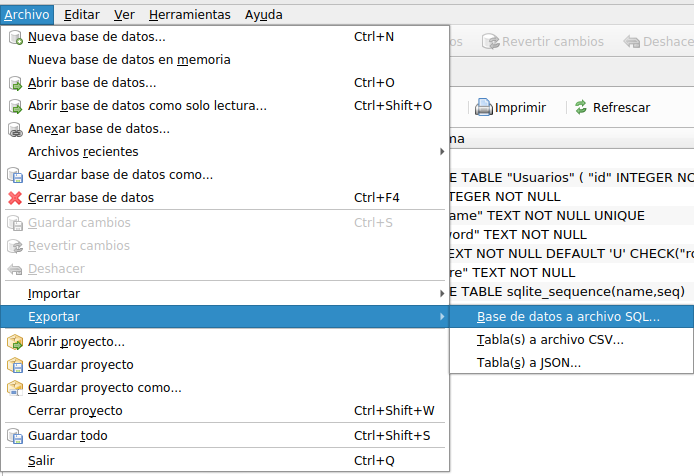
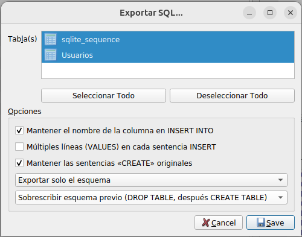
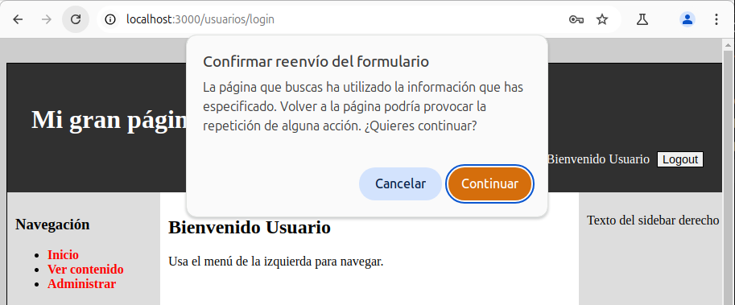

# Ejercicio 3: Estructura del proyecto

### Acerca del ejercicio

En este ejercicio partiremos de una posible solución del ejercicio 2 y organizaremos y mejoraremos el código del proyecto con el objetivo de lograr una estructura adecuada NodeJs / express de tamaño medio. Esta solución ya incluye la integración con base de datos, define y aplica algunos `middlewares` de express para comprobar que el usuario está identificado en la aplicación, etc.

La finalidad del ejercicio es que adquieras nuevas habilidades en cada uno de los apartados del ejercicio y que puedas aplicarlas a tu proyecto. Con este objetivo, para cada uno de los apartados del ejercicio se proporciona un punto de partida de modo que si te quedas atascado en el apartado anterior, puedas seguir con los siguientes apartados del ejercicio.

## 1. Backup de la BD en el repositorio

> Comienza este apartado utilizando el contenido de `01-inicio.zip`.

No es recomendable guardar ficheros binarios en un repositorio de git, en especial ficheros de gran tamaño. Asimismo, tampoco es recomendable guardar ficheros binarios asociados a una BD `sqlite`.
> Por simplicidad los ficheros con los recursos gráficos (e.g. botones, pequeñas imágenes, logo, etc.) que forman parte de la imagen / diseño de nuestra aplicación web la guardaremos en el repositorio.

No obstante, sí que es recomendable tanto para facilitar el desarrollo colaborativo como medida de seguridad, realizar una copia de seguridad de:
1. La estructura en tablas de la BD.
2. Un conjunto de datos de prueba suficiente para la aplicación.

De este modo, los ficheros con las instrucciones sql también se podrán gestionar con git de modo que podáis gestionar la historia y evolución tanto del esquema como de los datos de prueba de vuestro proyecto.

La idea es crear ficheros `.sql` para ambas copias de seguridad. Aunque puedes crear los ficheros `.sql` a mano, lo más sencillo (y que puedes utilizar como punto de partida) es utilizar *DB Browser for SQLite* para que te ayude en el proceso (otras herramientas puede que tegan funcionalidades similares).

Para hacer la copia, abre el fichero `aw_sw.db` en *DB Browser for SQLite* y selecciona la opción de menú *Archivo > Exportar > Base de datos a archivo SQL...*



En la nueva ventana podrás tendrás que:
1. Pulsar el botón *Seleccionar Todo*
2. En el primer desplegable seleccionar *Exportar solo el esquema*
3. En el segundo depslegale seleccionar *Sobresribir esquema previo*

Es recomendable nombrar este fichero como `data/01-crea.sql`.



La exportación de los datos es similar:
1. Pulsar el botón *Seleccionar Todo*
2. Activar la opción *Mantener el nombre de las columnas en INSERT INTO*.
3. En el depslegale seleccionar *Exportar solo los datos*

Es recomendable nombrar este fichero como `data/02-datos.sql`.

Si estás utilizando el punto de partida de este apartado. Tendrás que modificar el fichero `data/.gitignore` para poder gestionar los nuevos ficheros creados. El contenido de este fichero debería tener el siguiente contenido:
```
*.db*
```

Que ignorará todos los ficheros relacionados con la base de datos pero no las copias de seguridad en SQL creadas.

## 2. Configuración de `express-validator`

> Si te te pierdes, comienza este apartado utilizando el contenido de `02-inicio.zip`.

La librería `express-validator` permite validar y sanitizar la entrada proporcionada por el usuario. El proyecto de partida de este apartado ya tiene instalada la librería y ésta se aplicada en la funcionalidad de registro de nuevos usuarios para la aplicación.

El objetivo de este apartado, es que apliques la librería `express-validator` en las operaciones (que tengan sentido) del login del usuario. En particular, tiene sentido que:
- No se puede hacer login si los datos proporcionados por el usuario están vacíos.
- Hay que informar al usuario qué campo específico tiene el problema.
- En el caso de que la contraseña no coincida, sigue siendo un error "general" y normalmente se informa como *El usuario o la contraseña no coinciden* para evitar dar pistas a un potencial atacante.

## 3. Mejora de la gestión de formularios

> Si te pierdes, comienza este apartado utilizando el contenido de `03-inicio.zip`.

Por ahora, los formularios web, los hemos gestionado del siguiente modo, por ejemplo a la hora de hacer el login con `/usuarios/login`:
1. GET `/usuarios/login` muestra el contenido del formulario web para realizar le login.
2. El usuario rellena el formulario y pulsa el botón de enviar.
3. POST `/usuarios/login` recibe la petición de login y:
   1. Si los datos son incorrectos, volvemos a mostrar nuevamente el formulario con los datos parcialmente rellenos (normalmente las contraseñas no se rellenan).
   2. Si los datos son correctos, implementamos la acción de login (e.g. modificar la sesión) y mostramos el contenido de bienvenida.

Un problema de usabilidad y, potencialmente, de seguridad / inconveniente puede darse debido a una acción voluntaria del usuario. En particular, si el usuario:
1. Recarga la página del navegador
2. Pulsa el botón atrás y posteriormente el botón adelante.

Se mostrará un mensaje similar al siguiente:


Si pulsamos el mensaje continuar se volverá a enviar la petición POST `/usuarios/login`. En el caso del login, no es demasiado problemático, pero este mismo problema lo tenemos en un formulario asociado al proceso de compra y, en este caso, **se realizaría el pedido 2 veces**.

Para evitar éste y otros problema similares, tenemos que *romper este ciclo*. Para romperlo, tenemos que modificar el proceso de gestión de los formularios para el subcaso "datos correctos" y, en vez de generar directamente el contenido, **redirigimos al usuario a una página nueva**.

Sin embargo, al redireccionar al usuario, no podemos pasar parámetros al método `res.render` directamente. No obstante, como es un problema habitual, ha surgido el concepto de *mensajes flash* para paliarlo.

Los mensajes flash suelen almacenarse como cookies o atributos de sesión, para que «sobrevivan» a las redirecciones. Podemos utilizar el siguiente middleware para añadir esta nueva funcionalidad.

```
app.use((request, response, next) => {
    response.setFlash = (msg) => {
        request.session.flashMsg = msg;    
    };
    
    response.locals.getAndClearFlash = () => {
        let msg = request.session.flashMsg;
        delete request.session.flashMsg;
        return msg;
    };
});
```

Ahora en nuestros controladores, podremos:
- Usar `response.setFlash('mi mensaje')` para dejar un nuevo mensaje en nuestros controladores.
- Usar `getAndClearFlash()` en la plantilla correspondiente para poder pintar el mensaje.

Además se hace un uso **eficiente** de la sesión del usuario, porque el mensaje se elimina una vez se ha consumido. En general, es una buena práctica intentar minimizar la información que dejamos en la sesión y, en su caso, limitar el tiempo.
> Nota: Normalmente, podemos pasar parámetros por la URL cuando se realiza una redirección `res.redirect(`/productos/${producto.id}`);` de modo que no hace falta utilizar la sesión en esos casos.

En este apartado se pide:
- Modificar la gestión del formulario de login, para evitar el problema descrito al recargar la página.
> Pista: El formulario de registro ya está corregido.
- Añade un mensaje flash ``` `Encantado de verte de nuevo: ${usuario.nombre}` ``` en el controlador.
  - Tendrás que crear y utilizar el middleware mostrado anteriormente.
- Muestra el mensaje flash en la página `/usuarios/home`. Para mostrar los mensajes, utiliza un diálogo modal adaptando el [ejemplo de diálogos modales de MDN](https://developer.mozilla.org/en-US/docs/Web/CSS/:modal).
> Pista: `vistas/paginas/home` ya tiene adaptado el HTML, CSS y JS del lado del cliente para mostrar el diálogo modal.

## 4. Configuración de la aplicación mediante variables de entorno

> Si te pierdes, comienza este apartado utilizando el contenido de `04-inicio.zip`.

En la versión actual de la aplicación si quieres cambiar el puerto de configuración de la aplicación, tienes que editar `src/config.js` y modificar `config.port`. Este modelo no es adecuado para una aplicación real.

Aunque lo ideal es que todos los parámetros de nuestra aplicación sean configurables, limitaremos los cambios a aquellos parámetros que tengan mayor probabilidad de ser cambiados cuando desplegamos la aplicación. En nuestro caso:
- `config.port`: Puerto en el que escuchará la aplicación
- `config.session.secret`: Secreto utilizado por `express-session` para gestionar la confidencialidad de las sesiones de los usuarios.

Un modelo de desarrollo habitual, consiste en pasar los parámetros de configuración a través de variables de entorno. Estas variables de entorno son accesibles en nuestra aplicación a través de [`process.env`](https://nodejs.org/docs/latest/api/process.html#process_process_env).

Modifica `src/config.js` para:
1. Tener los siguienes valores por defecto:
   - `config.port`: `3000`
   - `config.session.secret`: `"no muy secreto"`
2. Procesar las variables de entorno:
   - `APP_PORT`: Almacenará el valor del puerto a utilizar en la aplicación. Si no está definida o su valor no es una cadena que represente un entero válido [^1] se utilizará el valor por defecto.
   - `APP_SESSION_SECRET`: Almacenará el secreto a utilizar para las sesiones de la aplicación. Si no está definida se utilizará el valor por defecto.

[^1]: Puedes utilizar la función `parseInt` para convertir una cadena a un entero válido. Ten en cuenta que devuelve `NaN` si falla el proceso de conversión.

Comprueba que funciona la configuración arrancando la aplicación del siguiente modo:
```
node@pruebas:/app/ejercicio3$ APP_PORT=3100 npm run dev:watch
# ...
PRAGMA journal_mode = WAL
SELECT 1+1 as suma
Server is listening on port 3100
```

Podemos ver en el terminal que el puerto es **`3100`** en vez del valor por defecto.

En aplicaciones NodeJS el uso de `process.env` es un modelo bastante extendido, pero tiene la desventaja de requerir que el desarrollador establezca adecuadamente todas las variables de entorno oportunas y, en algunos casos como los secretos necesarios para la apliación (e.g. passwords, API keys, etc.), no es muy adecuado que se configuren a través de variables de entorno ya que pueden ser accedidas / consultadas por otros usuarios.

Para evitar este problema, y resolver otros, podemos utilizar la librería `dotenv` cuya descripción es la siguiente:

> Dotenv is a zero-dependency module that loads environment variables from a `.env` file into [`process.env`](https://nodejs.org/docs/latest/api/process.html#process_process_env). Storing configuration in the environment separate from code is based on [The Twelve-Factor App](https://12factor.net/config) methodology.

Como primer paso integraremos la librería `dotenv` en nuestro proyecto. Lo detalles los puedes encontrar [en la página oficial de dotenv](https://www.npmjs.com/package/dotenv). De manera resumida tienes que:
1. Instalar la dependencia con `npm install dotenv`
2. Añadir como primera línea de `src/config.js` la instrucción `import 'dotenv/config';`. Como `src/config.js` es importado como primera dependencia en `src/server.js` cumplimos con el requisito de `dotenv` de cargarla cuanto antes en nuestra aplicación.
3. Crear el fichero `.env` incluyendo la incialización de las variables `APP_PORT`, `APP_SESSION_SECRET`.

Vuelve a probar la configuración, pero esta vez arranca la aplicación solamente con `npm run dev:watch` ya que si también definimos la variable de entorno ésta **tiene prioridad** sobre el valor definido en el fichero `.env`. Al igual que en la prueba anterior, deberías de ver por el terminal el puerto concreto que hayas configurado en el fichero.

Es habitual añadir a `.gitignore` el fichero `.env` de modo que no se incluya en el repositorio ya que puede contener secretos que, en el caso de tener un repositorio git público, puede ser utilizado por un potencial atacante para hacer alguna maldad. Para facilitar su uso, sí que es habitual encontrar un fichero de configuración (e.g. `env-ejemplo`, `env-example`, `env-sample`) con valores de prueba / ejemplo para los parámetros y que sí que incluyamos en el repositorio de git.

Aunque no es necesario para nuestro proyecto, para entornos y aplicaciones más complejas, también se puede utilizar `dotenv-flow` o `dotenvx` para poder tener diferentes configuraciones dependiendo del entorno donde queramos desplegar la aplicación.

# 5. Funciones asíncronas

> Si te pierdes, comienza este apartado utilizando el contenido de `05-inicio.zip`.

Como hemos comentado en clase, la manera eficiente de aprovechar las características de NodeJS requieren de aprovechar las funciones asíncronas que nos proporcionan. De este modo, al invocar funciones costosas tanto en CPU como de I/O no bloquearemos la gestión de peticiones.

En este apartado vamos a modificar el proceso de login para utilizar las versiones asíncronas de las operaciones de gestion de contraseñas, en particular la operación `bcrypt.compare` para implementar la operación de login.

> Nota: Ya se ha implementado el registro de usuario de manera asíncrona para que lo tengas ejemplo.

En este apartado se pide:
- Modificar `Usuario.login` para que utilice la operación asíncrona `bcrypt.compare`.
  - Necesitas esperar con `await` resultado de la operación para lanzar la excepción oportuna.
  - Al usar `await` te obliga a modificar la declarción de `Usuario.login` para convertirla en asíncrona.
- Modifica el controlador `doLogin` para
  - Esperar con `await` la operación de login sobre el usuario.
  - Modificar la declaración de `doLogin` para convertirla en una operación asíncrona.

## 6. Configuración de logger con pino

> Si te pierdes, comienza este apartado utilizando el contenido de `06-inicio.zip`.

Los mensajes depuración puede ser útiles pero tiene varias desventajas:
- Los mensajes con `console.log` son lentos. Dependiendo del contexto [la operación puede ser síncrona](https://nodejs.org/api/process.html#process_a_note_on_process_i_o).
- Todos los mensajes son tratados por igual en NodeJS. Pese a tener `console.info`, `console.debug`, todos son un alias de `console.log`. Dependiendo de si estamos desarrollando o desplegándolo para entregarlo, podemos querer filtar los mensajes de desarrollo (e.g. `console.debug`, `console.trace`) para que no molesten.
- Los mensajes se "pierden". Por defecto, `console.log` coloca los mensajes en la salida estándar STDOUT o STDERR. Dependiendo de cómo lancemos nuestra aplicación los mensajes se pierden al cerrarse la aplicación y/o es difícil revisarlos con cuidado.

Para evitar estos y otros problemas, es habitual utiliza una librería de logging. En NodeJS existen múltiples librerías con características similares. Nosotros vamos a utilizar `pino`. Los conceptos más relevantes que tenemos que tener en cuenta son:
- Tenemos que configurar el *level* adecuado para ver los mensajes. `pino` tiene los siguientes niveles por defecto (de menor a mayor importancia): `trace`,	`debug`, `info`, `warn`, `error`, `fatal`. Si configuramos pino a nivel `info` los mensajes de menor importancia serán ignorados.
- Si queremos procesar / modificar los mensajes de log, tendremos que utilizar un [transport](https://github.com/pinojs/pino/blob/main/README.md#transports--log-processing). Por ejemplo, si queremos mostrar por pantalla y guardar en un archvivo los las entradas de log, necesitaremos dos transport.

Para usar pino primero tendremos que instalarlo. Necesitamos instalar `pino`, `pino-http` para facilitar la integración en una aplicación web y la integración con `express` y `pino-pretty` (en modo desarrollo `npm install -D`). Una vez instaladas las dependencias, podemos tenemos que crear la configuración apropiada para pino y crear la instancia.

Para facilitarte la tarea, el proyecto ya tiene configurado pino (revisa `config.js`), crea una instancia de pino que muestra los mensajes por `stdout` y los guarda en un fichero `.log` (revisa `logger.js`) y puedes ver cómo se usa en `server.js` y `db.js`.

El objetivo de este apartado es que modifiques los controladores `doLogin` y `doRegistro` para que, en caso de error se registren dos mensajes de log:
- Un mensaje de nivel `error` para registrar el problema con el login / registro.
- Un mensaje de nivel `debug` que, además del registre el mensaje genérico, también registre el mensaje de la excepción capturada.

## 7. Gestión de errores centralizada

> Si te pierdes, comienza este apartado utilizando el contenido de `07-inicio.zip`.

El objetivo de este apartado es crear y configurar un middleware para gestionar los errores **inesperados** de manera centralizada en la aplicación. Los errores inesperados son aquellos que no gestionas con `try-catch` directamente en tu código.

Crea un nuevo middlware `error/error.js` con el siguiente contenido:
```javascript
function errorHandler (err, req, res, next) {

    if (res.headersSent) {
        req.logger.error(err, 'An error occurred after request was sent')
        return
    }

    // Comprobamos si el error tiene una propiedad que podamos usar como código de error
    let statusCode = 500;
    if ('statusCode' in err) {
        statusCode = err.statusCode;
    }

    // Comprobamossi el error tiene una propiedad que podamos usar como mensaje
    let message = 'Oops, ha ocurrido un error';
    if ('message' in err) {
        message = err.message;
    }

    // Dependiendo del tipo error logamos con un nivel u otro
    const loglevel =
        statusCode === 401 || statusCode === 404
            ? 'debug'
            : statusCode < 500
                ? 'warn'
                : 'error';
    // Equivale a req.log.debug / req.log.warn / req.log.error dependiendo del código de estado
    req.log[loglevel](err);

    // Si es una petición REST => generamos JSON
    if (req.is('application/json')) {
        return res.status(statusCode).json({
            code: statusCode,
            message
        });
    }
    // Si es otro tipo de petición (e.g generada por el usuario) mostramos página de error
    render(eq, res, 'paginas/error', {
        message
    });
}
```
Una vez creado:
- Configura el middelware en `app.js` recuerda que este middleware debe ser el último (o de los últimos de tu aplicación).
- Crea la página `vistas/paginas/error.ejs` para mostrar el mensaje de error.

Aunque hemos configurado de manera centralizada los errores, aquellos generados desde `Promise`s o con `async / await` no son gestionados de manera adecuada ya que **como nos indica expressjs en su documentación** debemos de invocar a `next(error)` con el error a gestionar.

Para resolver este problema:
- Instala la librería [exress-async-handler](https://github.com/Abazhenov/express-async-handler) con `npm install express-async-handler`.
- Modifica los router para **envolver** todos los controllers:
``` 
import asyncHandler from 'express-async-handler';
....
router.get('/', ..., asyncHandler(viewLogin));
```

# Entrega

Entrega el ejercicio a través de la tarea creada en el CV. Este ejercicio, debido a su relevancia es interesante que lo desarrolles de manera individual. Crea un fichero `.zip` con:
- El contenido del último apartado que hayas terminado.
- Un fichero `apartado.txt` que indica el número del último apartado que has terminado (e.g. `apartado 6`).
- En el caso de que realices el ejercicio por parejas incluye un fichero `estudiantes.txt` con los nombres delos estudiantes.